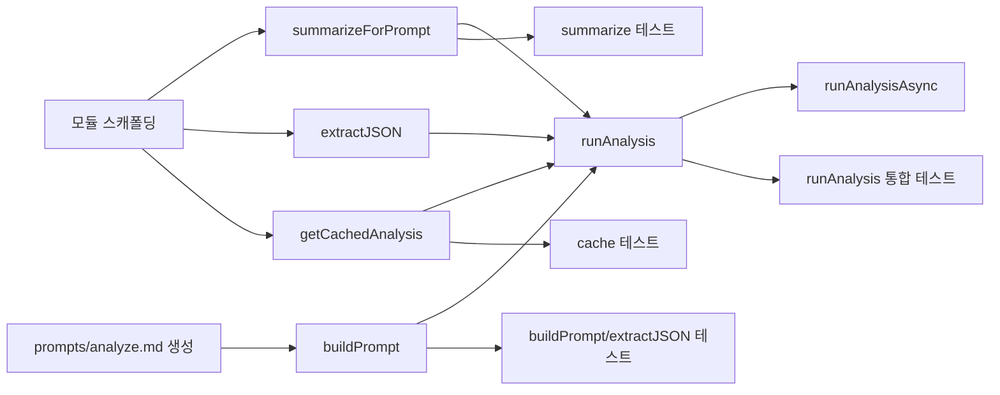

# Tasks: AI 분석 실행 모듈 (ai-analyzer)

## 개요

- 총 작업 수: 12개
- 예상 복잡도: 높음

---

## 작업 목록

### Phase 1: 기반 구축

- [ ] [P1] `prompts/analyze.md` 프롬프트 템플릿 파일 생성 (DESIGN.md 5.2절 기반)
- [ ] [P1] `lib/ai-analyzer.mjs` 모듈 스캐폴딩 (상수, import)

### Phase 2: 핵심 구현

- [ ] [P2] `summarizeForPrompt()` 구현 — 로그 요약 (최대 100 프롬프트, 세션별 도구 시퀀스)
- [ ] [P2] `buildPrompt()` 구현 — 템플릿 로드 및 플레이스홀더 치환
- [ ] [P2] `extractJSON()` 구현 — 코드 블록/순수 JSON 추출
- [ ] [P2] `getCachedAnalysis()` 구현 — TTL 기반 캐시 조회
- [ ] [P2] `runAnalysis()` 구현 — 동기 `claude --print` 실행 + 캐시 저장
- [ ] [P2] `runAnalysisAsync()` 구현 — 비동기 백그라운드 실행

### Phase 3: 테스트 및 마무리

- [ ] [P3] [→T] `summarizeForPrompt()` 단위 테스트
- [ ] [P3] [→T] `buildPrompt()`, `extractJSON()` 단위 테스트
- [ ] [P3] [→T] `getCachedAnalysis()` 단위 테스트 (유효/만료/없음)
- [ ] [P3] [→T] `runAnalysis()` 통합 테스트 (mock claude --print)

---

## 의존성 그래프

---

## 마커 범례

| 마커 | 의미 |
|------|------|
| [P1-3] | 우선순위 |
| [→T] | 테스트 필요 |
| [US] | 불확실/검토 필요 |
