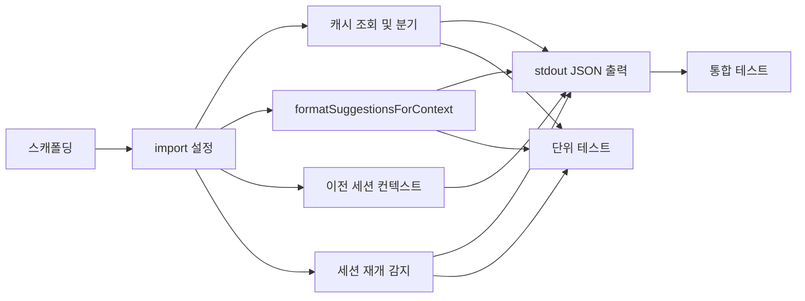

# Tasks: SessionStart 캐시 주입 훅 (session-start-hook)

## 개요

- 총 작업 수: 9개
- 예상 복잡도: 중간

---

## 작업 목록

### Phase 1: 기반 구축

- [ ] [P1] `hooks/session-analyzer.mjs` 훅 스크립트 스캐폴딩 (최상위 try-catch, stdin 읽기)
- [ ] [P1] 의존 모듈 import 설정 (`ai-analyzer.mjs`, `log-writer.mjs`)

### Phase 2: 핵심 구현

- [ ] [P2] `getCachedAnalysis(24)` 호출 및 suggestions 존재 여부 분기
- [ ] [P2] `formatSuggestionsForContext()` 구현 — 최대 3개 제안 포맷팅
- [ ] [P2] 이전 세션 컨텍스트 조회 — prompt-log.jsonl에서 마지막 session_summary 읽기
- [ ] [P2] 세션 재개 감지 — `source === 'resume'` 시 `[RESUME]` 태그 + 미해결 에러 주입
- [ ] [P2] stdout JSON 출력 — `hookSpecificOutput.additionalContext` 형식

### Phase 3: 테스트 및 마무리

- [ ] [P3] [→T] 단위 테스트 — 포맷팅, 캐시 분기, resume 감지, 예외 처리
- [ ] [P3] [→T] 통합 테스트 — 실제 캐시 파일로 훅 실행 → stdout JSON 검증

---

## 의존성 그래프

---

## 마커 범례

| 마커 | 의미 |
|------|------|
| [P1-3] | 우선순위 |
| [→T] | 테스트 필요 |
| [US] | 불확실/검토 필요 |
