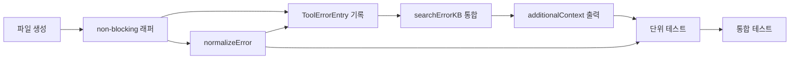

# 작업 목록: error-logger

## 개요

- 총 작업 수: 8개
- 예상 복잡도: 중간

---

## 작업 목록

### Phase 1: 기반 구축

- [ ] [P1] `hooks/error-logger.mjs` 파일 생성 및 log-writer import 설정
- [ ] [P1] try-catch + `process.exit(0)` non-blocking 래퍼 구조 작성

### Phase 2: 핵심 구현

- [ ] [P2] ToolErrorEntry 스키마 구성 및 `appendEntry` 호출 — `v`, `type`, `ts`, `sessionId`, `project`, `projectPath`, `tool`, `error`, `errorRaw`
- [ ] [P2] `normalizeError()` 구현 — 경로(`<PATH>`) → 숫자(`<N>`) → 문자열(`<STR>`) 순서 치환 + 200자 제한 + trim
- [ ] [P2] `searchErrorKB()` 통합 — error-kb.mjs에서 import하여 정규화된 에러로 KB 검색
- [ ] [P2] `additionalContext` stdout 출력 — KB 매칭 시 `hookSpecificOutput` JSON 형식으로 해결 이력 주입

### Phase 3: 마무리

- [ ] [P3] [->T] 단위 테스트 — normalizeError 경로/숫자/문자열/순서/길이 제한 테스트
- [ ] [P3] [->T] 통합 테스트 — KB 매칭/미매칭 시 stdout 출력 검증, KB 오류 시 정상 종료 검증

---

## 의존성 그래프

---

## 마커 범례

| 마커 | 의미 |
|------|------|
| [P1-3] | 우선순위 |
| [->T] | 테스트 필요 |
| [US] | 불확실/검토 필요 |
