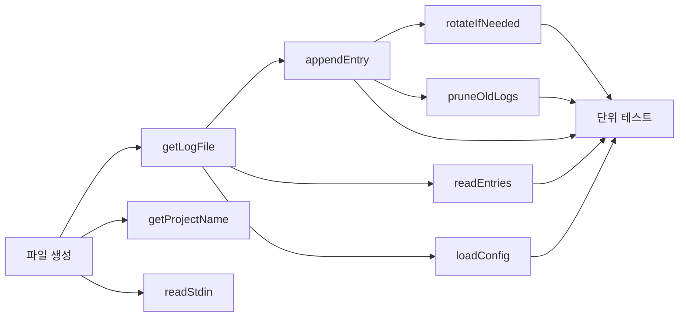

# 작업 목록: log-writer

## 개요

- 총 작업 수: 10개
- 예상 복잡도: 중간

---

## 작업 목록

### Phase 1: 기반 구축

- [ ] [P1] `lib/log-writer.mjs` 파일 생성 및 ES Module 설정
- [ ] [P1] `getLogFile()` 구현 — 로그 파일 경로 반환 + `data/` 디렉토리 자동 생성
- [ ] [P1] `getProjectName(cwd)` 구현 — cwd에서 프로젝트 디렉토리명 추출
- [ ] [P1] `readStdin()` 구현 — stdin 동기 읽기 + JSON 파싱 (64KB 버퍼 반복)

### Phase 2: 핵심 구현

- [ ] [P2] `appendEntry(logFile, entry)` 구현 — JSON 직렬화 + 개행 추가 + 로테이션 검사
- [ ] [P2] `readEntries(logFile, filterOrLimit)` 구현 — 필터 조회(type/sessionId/project/projectPath/since) + 숫자 축약 조회
- [ ] [P2] `rotateIfNeeded(logFile)` 구현 — 50MB 초과 시 타임스탬프 접미사로 리네임 + TOCTOU 처리
- [ ] [P2] `pruneOldLogs()` 구현 — 90일 초과 로테이션 파일 삭제 + 1% 확률 트리거
- [ ] [P2] `loadConfig()` 구현 — config.json 로딩 + 7개 기본값 fallback

### Phase 3: 마무리

- [ ] [P3] [->T] 단위 테스트 작성 — appendEntry, readEntries, rotateIfNeeded, pruneOldLogs, loadConfig, readStdin 각 함수별

---

## 의존성 그래프

---

## 마커 범례

| 마커 | 의미 |
|------|------|
| [P1-3] | 우선순위 |
| [->T] | 테스트 필요 |
| [US] | 불확실/검토 필요 |
