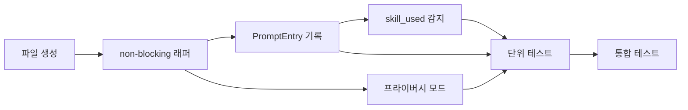

# 작업 목록: prompt-logger

## 개요

- 총 작업 수: 7개
- 예상 복잡도: 낮음

---

## 작업 목록

### Phase 1: 기반 구축

- [ ] [P1] `hooks/prompt-logger.mjs` 파일 생성 및 log-writer import 설정
- [ ] [P1] try-catch + `process.exit(0)` non-blocking 래퍼 구조 작성

### Phase 2: 핵심 구현

- [ ] [P2] PromptEntry 스키마 구성 및 `appendEntry` 호출 — `v`, `type`, `ts`, `sessionId`, `project`, `projectPath`, `text`, `charCount`
- [ ] [P2] 프라이버시 모드 구현 — `loadConfig().collectPromptText === false` 시 `text`를 `"[REDACTED]"`로 대체
- [ ] [P2] 슬래시 커맨드 감지 및 `skill_used` 이벤트 기록 — `/`로 시작하는 프롬프트에서 스킬명 추출

### Phase 3: 마무리

- [ ] [P3] [->T] 단위 테스트 — 일반 프롬프트, 프라이버시 모드, 슬래시 커맨드, 잘못된 stdin
- [ ] [P3] 통합 테스트 — stdin mock으로 전체 훅 실행 플로우 검증

---

## 의존성 그래프

---

## 마커 범례

| 마커 | 의미 |
|------|------|
| [P1-3] | 우선순위 |
| [->T] | 테스트 필요 |
| [US] | 불확실/검토 필요 |
