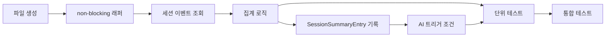

# 작업 목록: session-summary

## 개요

- 총 작업 수: 8개
- 예상 복잡도: 중간

---

## 작업 목록

### Phase 1: 기반 구축

- [ ] [P1] `hooks/session-summary.mjs` 파일 생성 및 log-writer import 설정
- [ ] [P1] try-catch + `process.exit(0)` non-blocking 래퍼 구조 작성

### Phase 2: 핵심 구현

- [ ] [P2] 세션 이벤트 조회 — `readEntries(logFile, { sessionId })` 로 현재 세션 이벤트 필터링
- [ ] [P2] 집계 로직 구현 — `promptCount`, `toolCounts` (도구별 횟수 객체), `toolSequence` (시간순 도구명 배열), `errorCount`, `uniqueErrors` (Set 기반 중복 제거)
- [ ] [P2] SessionSummaryEntry 스키마 구성 및 `appendEntry` 호출
- [ ] [P2] AI 분석 트리거 조건 구현 — `promptCount >= 3 && reason !== 'clear'` 시 `runAnalysisAsync()` 호출 (Phase 2 활성화)

### Phase 3: 마무리

- [ ] [P3] [->T] 단위 테스트 — 집계 정확성 (toolCounts, uniqueErrors), 빈 세션 처리
- [ ] [P3] [->T] 통합 테스트 — AI 트리거 조건 분기 (3개 이상/미만, clear 이유), 전체 플로우 검증

---

## 의존성 그래프

---

## 마커 범례

| 마커 | 의미 |
|------|------|
| [P1-3] | 우선순위 |
| [->T] | 테스트 필요 |
| [US] | 불확실/검토 필요 |
