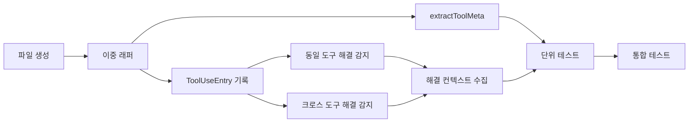

# 작업 목록: tool-logger

## 개요

- 총 작업 수: 9개
- 예상 복잡도: 높음

---

## 작업 목록

### Phase 1: 기반 구축

- [ ] [P1] `hooks/tool-logger.mjs` 파일 생성 및 db.mjs, error-kb import 설정
- [ ] [P1] try-catch 이중 래퍼 구조 작성 (외부: 전체, 내부: 해결 감지)

### Phase 2: 핵심 구현

- [ ] [P2] ToolUseEntry 스키마 구성 및 `insertEvent()` 호출 — `v`, `type`, `ts`, `sessionId`, `project`, `projectPath`, `tool`, `meta`, `success`
- [ ] [P2] `extractToolMeta()` 구현 — Bash(첫 단어), Read/Write/Edit(파일 경로), Grep/Glob(패턴), Task(에이전트 정보), 기본(빈 객체)
- [ ] [P2] 동일 도구 해결 감지 구현 — 최근 100개 엔트리에서 세션 내 동일 도구 에러 → 성공 패턴 감지 + `recordResolution` 호출
- [ ] [P2] 크로스 도구 해결 감지 구현 — 다른 도구 에러가 현재 도구의 도움으로 해결된 패턴 감지
- [ ] [P2] 해결 컨텍스트 수집 — `toolSequence` (에러-성공 사이 최대 5개), `promptContext` (마지막 프롬프트 200자), `filePath`

### Phase 3: 마무리

- [ ] [P3] [->T] 단위 테스트 — extractToolMeta 7개 도구 유형, Bash 첫 단어 추출
- [ ] [P3] [->T] 통합 테스트 — 동일 도구/크로스 도구 해결 감지 시나리오, 해결 감지 실패 시 정상 종료

---

## 의존성 그래프

---

## 마커 범례

| 마커 | 의미 |
|------|------|
| [P1-3] | 우선순위 |
| [->T] | 테스트 필요 |
| [US] | 불확실/검토 필요 |
