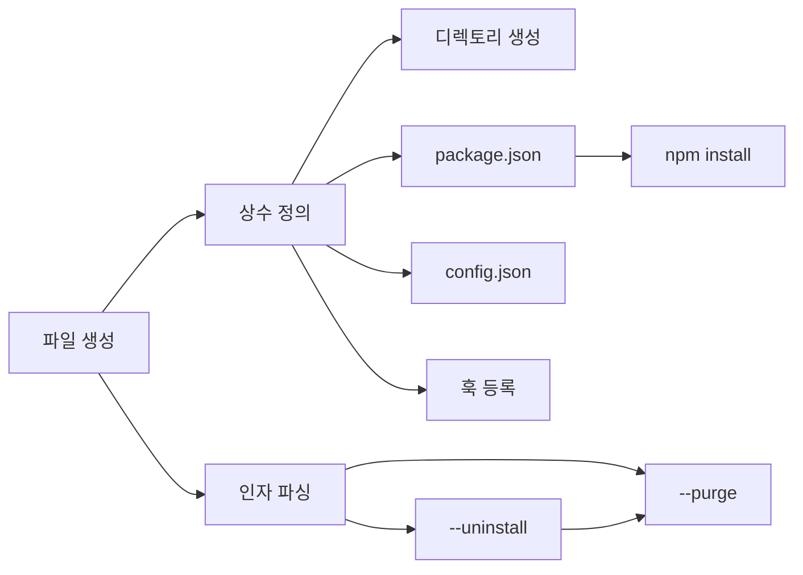

# 작업 목록: install-cli

## 개요

- 총 작업 수: 10개
- 예상 복잡도: 중간

---

## 작업 목록

### Phase 1: 기반 구축

- [ ] [P1] `bin/install.mjs` 파일 생성 및 ES Module 설정
- [ ] [P1] 상수 정의 — `SELF_GEN_DIR`, `SETTINGS_PATH`, `HOOK_EVENTS` (8개 이벤트-스크립트 매핑)
- [ ] [P1] CLI 인자 파싱 — `--uninstall`, `--purge` 플래그 처리

### Phase 2: 설치 로직

- [ ] [P2] 디렉토리 구조 생성 — `data`, `hooks`, `lib`, `bin`, `prompts` 5개 하위 디렉토리
- [ ] [P2] `package.json` 생성 — 존재 여부 확인 후 조건부 생성 (3개 의존성)
- [ ] [P2] `npm install --production` 실행 — `execSync` + 에러 처리
- [ ] [P2] `config.json` 초기화 — 존재 여부 확인 후 조건부 생성 (기본값 4개 필드)
- [ ] [P2] `settings.json` 훅 등록 — 8개 이벤트 병합, 중복 방지, PreToolUse matcher 처리

### Phase 3: 제거 로직

- [ ] [P3] `--uninstall` 처리 — `.self-generation` 포함 훅 필터링 제거, 빈 배열 정리
- [ ] [P3] `--purge` 처리 — `rmSync({ recursive: true, force: true })` 데이터 삭제

---

## 의존성 그래프

---

## 마커 범례

| 마커 | 의미 |
|------|------|
| [P1-3] | 우선순위 |
| [->T] | 테스트 필요 |
| [US] | 불확실/검토 필요 |
