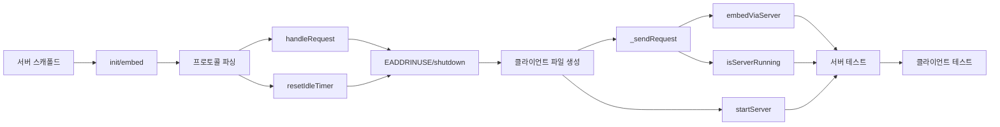

# Tasks: embedding-daemon

## 개요

- 총 작업 수: 14개
- 예상 복잡도: 중간~높음

---

## 작업 목록

### Phase 1: 서버 스캐폴드

- [ ] [P1] `lib/embedding-server.mjs` 파일 생성 — import (`net`, `@xenova/transformers`, `fs`, `path`, `os`), 상수 (`SOCKET_PATH`, `IDLE_TIMEOUT_MS`), 전역 변수 (`extractor`, `idleTimer`)
- [ ] [P1] `init()` 함수 구현 — `env.cacheDir` 설정 + `pipeline('feature-extraction', 'Xenova/paraphrase-multilingual-MiniLM-L12-v2')` 모델 로딩
- [ ] [P1] `embed(texts)` 함수 구현 — 텍스트 배열 순회, null/빈 텍스트 → null 반환, `extractor(text, { pooling: 'mean', normalize: true })` 호출, `isFinite` 검증

### Phase 2: 서버 프로토콜 및 생명주기

- [ ] [P1] stale 소켓 정리 + `createServer()` + newline-delimited JSON 파싱 (data 이벤트에서 `\n` 구분 처리)
- [ ] [P1] `handleRequest(conn, message)` 구현 — `embed`/`health`/unknown action 분기, JSON 파싱 에러 처리
- [ ] [P1] `resetIdleTimer()` 구현 — 30분 타이머 관리, 만료 시 `server.close()` + `process.exit(0)`
- [ ] [P1] EADDRINUSE 에러 핸들러 + SIGTERM/SIGINT graceful shutdown 핸들러

### Phase 3: 클라이언트 구현

- [ ] [P1] `lib/embedding-client.mjs` 파일 생성 — import (`net`), 상수 (`SOCKET_PATH`, `TIMEOUT_MS`)
- [ ] [P1] `_sendRequest(texts)` 내부 함수 — `createConnection`, JSON 송수신, 10초 타임아웃, `embeddings` 필드 추출
- [ ] [P1] `embedViaServer(texts)` export 함수 — ECONNREFUSED/ENOENT 시 `startServer()` + 5초 대기 + 1회 재시도
- [ ] [P1] `isServerRunning()` export 함수 — health check 소켓 연결, 500ms 타임아웃, boolean 반환
- [ ] [P1] `startServer()` export 함수 — `spawn('node', [serverPath], { detached: true, stdio: 'ignore' })` + `child.unref()`

### Phase 4: 테스트

- [ ] [P2] [->T] 서버 단위 테스트 — `embed()`, `handleRequest()`, idle timeout, EADDRINUSE, graceful shutdown
- [ ] [P2] [->T] 클라이언트 단위 테스트 — `_sendRequest()`, `embedViaServer()` retry, `isServerRunning()`, `startServer()`

---

## 의존성 그래프

---

## 마커 범례

| 마커 | 의미 |
|------|------|
| [P1-3] | 우선순위 |
| [->T] | 테스트 필요 |
| [US] | 불확실/검토 필요 |
