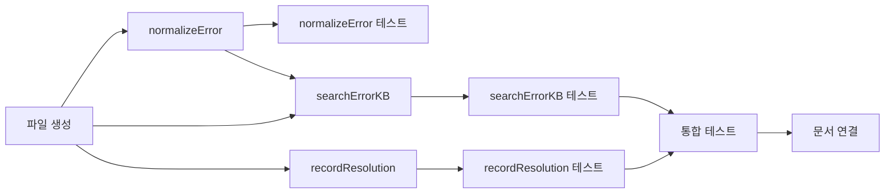

# Tasks: error-kb

## 개요

- 총 작업 수: 9개
- 예상 복잡도: 중간

---

## 작업 목록

### Phase 1: 스캐폴드

- [ ] [P1] `lib/error-kb.mjs` 파일 생성 — KB_FILE 상수, fs/path import, export 구조 설정
- [ ] [P1] `normalizeError(msg)` 구현 — PATH/N/STR 정규식 치환 + 200자 절단 + trim
- [ ] [P1] [->T] `normalizeError()` 단위 테스트 — 경로, 숫자, 문자열 치환, 200자 절단, 빈 입력

### Phase 2: 핵심 구현

- [ ] [P1] `searchErrorKB(normalizedError)` 구현 — 역순 exact match → substring fallback (앞 30자), useCount 증가
- [ ] [P1] `recordResolution(normalizedError, resolution)` 구현 — ErrorKBEntry 스키마로 `error_kb` 테이블에 INSERT
- [ ] [P2] [->T] `searchErrorKB()` 단위 테스트 — exact match, substring fallback, 파일 부재, resolution 없는 엔트리 스킵
- [ ] [P2] [->T] `recordResolution()` 단위 테스트 — 정상 기록, 파일 자동 생성, 스키마 검증

### Phase 3: 마무리

- [ ] [P2] [->T] 통합 테스트 — error-logger.mjs에서 normalizeError + searchErrorKB 호출 흐름
- [ ] [P3] 도메인 문서 연결 — realtime-assist domain.md의 "연결 스펙" 섹션 업데이트

---

## 의존성 그래프

---

## 마커 범례

| 마커 | 의미 |
|------|------|
| [P1-3] | 우선순위 |
| [->T] | 테스트 필요 |
| [US] | 불확실/검토 필요 |
