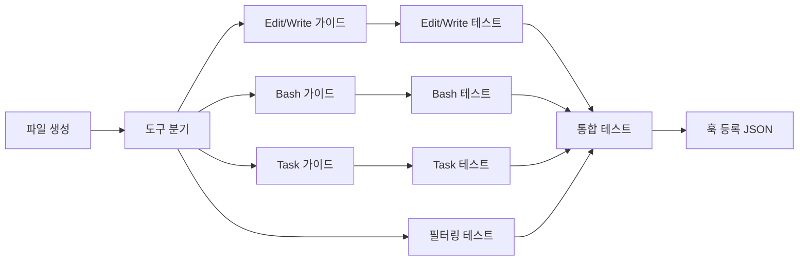

# Tasks: pre-tool-guide

## 개요

- 총 작업 수: 11개
- 예상 복잡도: 높음

---

## 작업 목록

### Phase 1: 스캐폴드 및 도구 필터링

- [ ] [P1] `hooks/pre-tool-guide.mjs` 파일 생성 — import (error-kb, db), try-catch
- [ ] [P1] 대상 도구 분기 구조 — Edit/Write, Bash, Task 분기 + 그 외 즉시 종료
- [ ] [P2] [->T] 도구 필터링 테스트 — Read, Glob 등 대상 외 도구 스킵 확인

### Phase 2: 도구별 가이드 로직

- [ ] [P1] Edit/Write 가이드 구현 — file_path 추출 → prompt-log에서 파일명 기반 에러 검색 (최근 3건) → searchErrorKB → 출력
- [ ] [P1] Bash 가이드 구현 — session_id 기반 Bash tool_error 검색 → searchErrorKB → toolSequence 표시
- [ ] [P1] Task 가이드 구현 — `events` 테이블 `subagent_stop` 타입 쿼리 → 에이전트 타입 필터 → 최근 20건 → 실패율 계산 → >30% 경고
- [ ] [P2] [->T] Edit/Write 가이드 테스트 — 에러 있음/없음, KB 매치 있음/없음
- [ ] [P2] [->T] Bash 가이드 테스트 — 세션 내 에러 있음/없음, toolSequence 표시
- [ ] [P2] [->T] Task 가이드 테스트 — 실패율 >30%, <=30%, 데이터 <5건

### Phase 3: 마무리

- [ ] [P2] [->T] 통합 테스트 — hookSpecificOutput JSON 포맷 검증 + exit 0 보장 + 복합 가이드 출력
- [ ] [P3] 훅 등록 JSON 준비 — settings.json PreToolUse 항목 문서화

---

## 의존성 그래프

---

## 외부 의존성

| 의존 피처 | 필요 함수/데이터 |
|-----------|----------------|
| error-kb | `searchErrorKB()` |
| db | `readStdin()`, `queryEvents()`, `getDb()` |
| subagent-tracker | `events` 테이블 `subagent_stop` 타입 데이터 |

---

## 마커 범례

| 마커 | 의미 |
|------|------|
| [P1-3] | 우선순위 |
| [->T] | 테스트 필요 |
| [US] | 불확실/검토 필요 |
