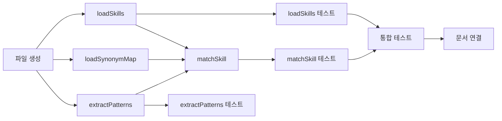

# Tasks: skill-matcher

## 개요

- 총 작업 수: 10개
- 예상 복잡도: 중간

---

## 작업 목록

### Phase 1: 스캐폴드 및 스킬 로드

- [ ] [P1] `lib/skill-matcher.mjs` 파일 생성 — CACHE_FILE 상수, fs/path import, export 구조 설정
- [ ] [P1] `loadSkills(projectPath)` 구현 — ~/.claude/commands + <projectPath>/.claude/commands 스캔, {name, scope, content} 배열 반환
- [ ] [P1] `loadSynonymMap()` 구현 — analysis-cache.json에서 analysis.synonym_map 읽기, 실패 시 {} 반환
- [ ] [P2] [->T] `loadSkills()` 단위 테스트 — 전역+프로젝트 로드, 디렉토리 부재, 빈 디렉토리

### Phase 2: 핵심 매칭 로직

- [ ] [P1] `extractPatterns(content)` 구현 — "감지된 패턴" 섹션 파싱, - 접두사 항목 추출, 따옴표 제거
- [ ] [P1] `matchSkill(prompt, skills, synonymMap)` 구현 — 시노님맵 매칭(confidence 0.8) → 키워드 매칭(50% 임계값) → null
- [ ] [P2] [->T] `extractPatterns()` 단위 테스트 — 패턴 섹션 있음/없음, 빈 파일
- [ ] [P2] [->T] `matchSkill()` 단위 테스트 — 시노님 매치, 키워드 50%+, 임계값 미달, 대소문자 무관

### Phase 3: 마무리

- [ ] [P2] [->T] 통합 테스트 — prompt-logger.mjs에서 loadSkills + matchSkill 호출 흐름
- [ ] [P3] 도메인 문서 연결 — realtime-assist domain.md의 "연결 스펙" 섹션 업데이트

---

## 의존성 그래프

---

## 마커 범례

| 마커 | 의미 |
|------|------|
| [P1-3] | 우선순위 |
| [->T] | 테스트 필요 |
| [US] | 불확실/검토 필요 |
